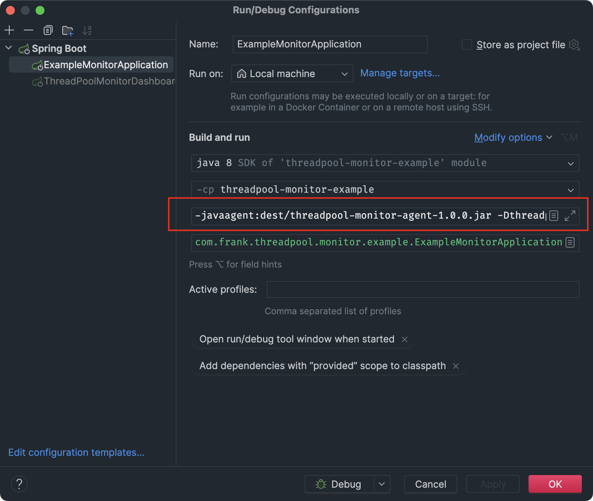
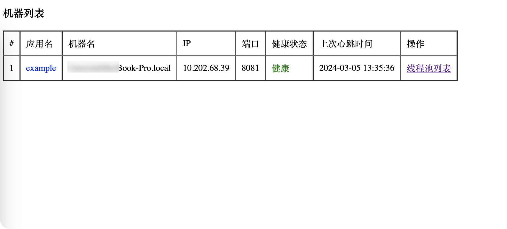
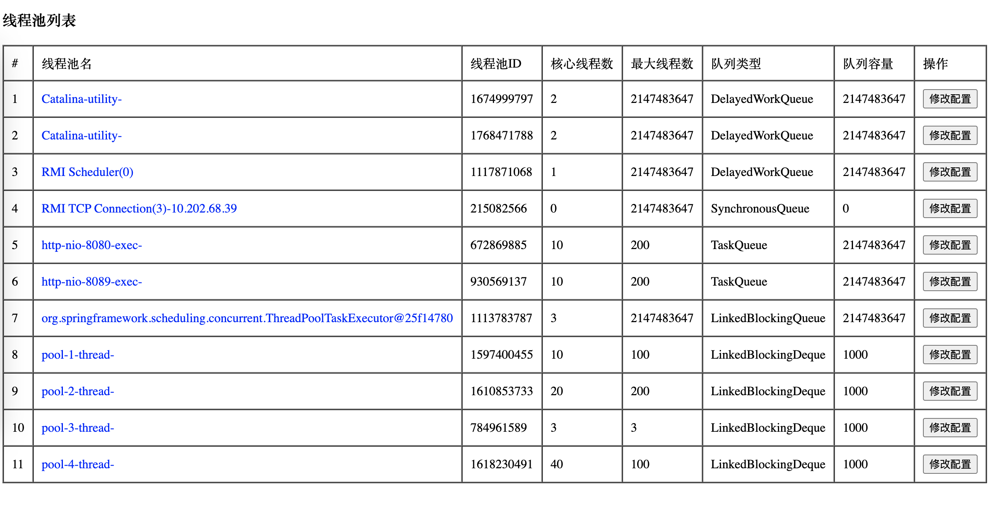
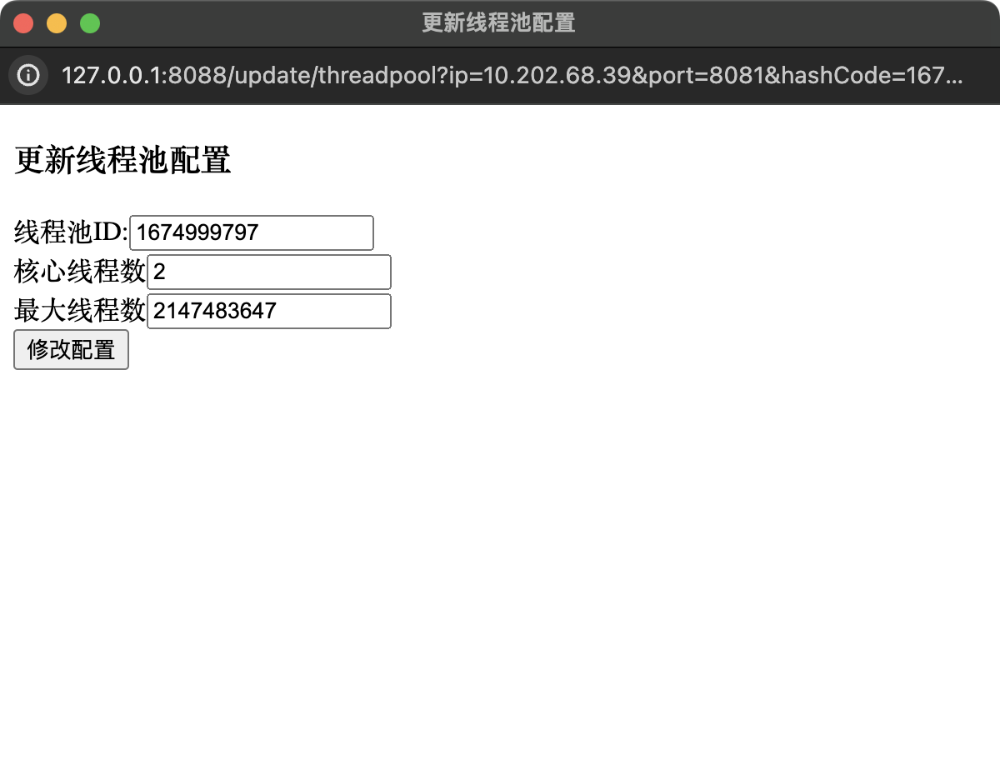

## 概述 
- 通过javaagent的方式监控线程池监控工具
####

## 快速开始
- 1.在[threadpool-monitor-agent-manager](threadpool-monitor-agent-manager) 工程下 使用命令 mvn clean install package 生成jar包
- 2.在[threadpool-monitor-agent](threadpool-monitor-agent) 工程下 使用命令 mvn clean package 生成jar包
- 3.在[threadpool-monitor-example](threadpool-monitor-example) 工程下 加上jvm参数 -javaagent:dest/threadpool-monitor-agent-1.0.0.jar -Dthreadpool.dashboard.server=127.0.0.1:8088 并启动

- 4.在 threadpool-monitor-dashboar[threadpool-monitor-dashboard](threadpool-monitor-dashboard)d 工程下启动
- 5.打开 http://localhost:8088/ ，查看机器列表

